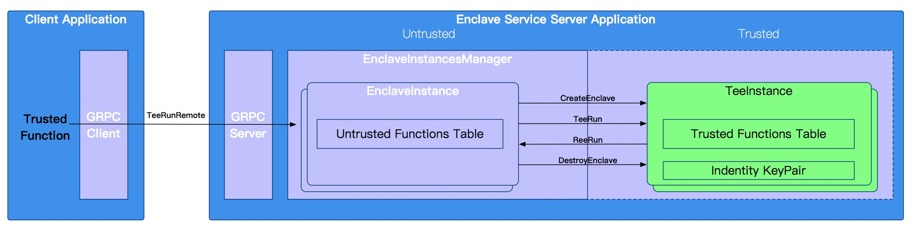

# KubeTEE TFF

KubeTEE TFF (Trusted Function Framework) is a Intel SGX partition model programming framework.
KubeTEE TFF implements PbFunction that supports protobuf message data encapsulation.
Developers can define Trusted-Function in the enclave (SGX application trusted part) or
Untrusted-Function out of enclave, without caring about the underlying implementation details of SGX ECall/OCall.

TFF also provides a enclave service example via gRPC. This example shows how a remote client can easily
access the enclave via remote trusted-function call.




# Quick Start

The following steps show how to build and run the TFF based enclave service demo in dev mode.
To release a formal product, you need more actions, for example, sign the enclave.so by the product key,
set product IAS key and SPID in the configuration files, sign the configuration files, and so on.

## Update sub-modules

KubeTEE TFF uses some [third party code](THIRD-PARTY-NOTICES),
before you try the examples, please update the sub-modules firstly.

```
$ git submodule update --init --recursive
```

## Build the source code in dev container

```
$ ./dockerbuild.sh [--build Debug|PreRelease|Release]
```

## Create the Docker Image for Example Enclave Service

Please set the enclave SPID and IAS access key in the configuration file "deployment/conf/kubetee.json".
You can apply the IAS access key and SPID from [here](https://api.portal.trustedservices.intel.com/EPID-attestation)

And you also need to generate the test certificates like this (for development and test only, should use formal certificates in product environment):

```
./tools/gencert gentest ./deployment/certs/
```

Then create the image with test certificates and configurations.

```
$ ./deployemnt/create_image.sh
```

## Run the example enclave service docker image

```
$ ./deployemnt/run_image.sh
```

## Deploy the service

Before the service deployment, it is necessary to ensure that the SGX-Device-Plugin already
exists in the Kubernetes cluster to provide SGX driver mounting and trusted memory allocation
capabilities.
For example, you can use Minikube to quickly deploy SGX-Device-Plugin and above example EnclaveService images.
In addition, you can also create a confidential computing Kubernetes cluster based on
[Alibaba Cloud Container Service for Kubernetes](https://www.aliyun.com/product/kubernetes).
By default, SGX Driver and SGX-Device-Plugin are automatically installed on each node.
Users only need to focus on application service development and deployment.


## Define and call the trusted function

For example, add trusted PbFunctions in trusted code （enclave_samples/protobuf_functions/enclave/enclave.cpp）

```
TeeErrorCode SayHello(const std::string& req_str, std::string* res_str) {
  PbGenericRequest req;
  PbGenericResponse res;
  PB_PARSE(req, req_str);
  std::string welcome = "Welcome to enclave, ";
  res.add_result(welcome + req.argv()[0]);
  PB_SERIALIZE(res, res_str);
  return TEE_SUCCESS;
}
TeeErrorCode RegisterTrustedPbFunctionsEx() {
  ELOG_DEBUG("Register application trusted functions");
  ADD_TRUSTED_PBCALL_FUNCTION(SayHello);
  return TEE_SUCCESS;
}
```

Call the trusted function from untrusted code (enclave_samples/protobuf_functions/app/app.cpp)

```
/* Trusted Application*/
int SGX_CDECL main(void) {
  std::string enclave_name = "SampleEnclave";
  EnclavesManager& em = EnclavesManager::GetInstance();
  EnclaveInstance* enclave = em.CreateEnclave(enclave_name, ENCLAVE_FILENAME);
  if (!enclave) {
    printf("Fail to creates enclave %s: 0x%x", enclave_name.c_str());
    return TEE_ERROR_CREATE_ENCLAVE;
  }
  // try to do something else before destroy enclave and exit
  PbGenericRequest req;
  PbGenericResponse res;
  req.add_argv("KubeTEE user");
  enclave.TeeRun("SayHello", req, &res);
  printf("Function result: %s\n", res.result()[0].c_str());
  return 0;
}
```


# Contributing

KubeTEE TFF is not final stable at this moment. We are considering add more product and Kubernetes related features later.
Anyone is welcome to provide any form of contribution, please see CONTRIBUTING.md for details.


# License

KubeTEE TFF is released by Ant Group under Apache 2.0 License.
Please see the copyright information [here](LICENSE) for detail.
